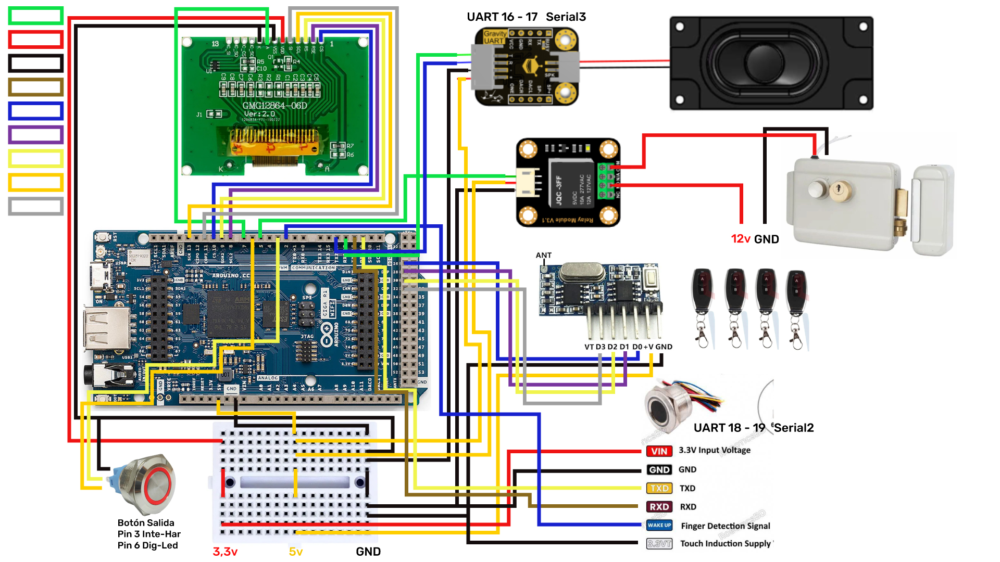

# Sitem_Acces_V1.0 - Control de Acceso con Arduino GIGA R1 WiFi

Sistema de control de acceso para puerta con:
- autenticacion por huella (R503),
- control de rele para apertura,
- audio por modulo MP3 UART,
- interfaz local en display ST7565 128x64,
- operacion remota por Arduino IoT Cloud (chat + notificaciones + accion remota).

## Imagen del circuito



## Microcontrolador principal

- Placa: `Arduino GIGA R1 WiFi`
- Core: `Arduino Mbed OS Giga Boards`
- Lenguaje: `Arduino (C++)`

## Funcionalidades principales

- Apertura de puerta por huella registrada.
- Apertura de puerta por boton local de salida.
- Apertura de puerta por 4 botones externos.
- Apertura remota por propiedad `led2` en Arduino Cloud.
- Registro de usuarios por chat cloud (nombre + enrolamiento de huella).
- Eliminacion de usuarios por nombre o ID de huella.
- Listado de usuarios activos desde chat cloud.
- Ajuste remoto de volumen del modulo MP3.
- Ajuste remoto de nivel de seguridad.
- Notificaciones de eventos por propiedad `notification`.
- Persistencia de usuarios y seguridad en QSPI (LittleFS, particion MBR #4).
- Visualizacion local en LCD: fecha, hora, estado WiFi y eventos.
- Sincronizacion RTC por red con `WiFi.getTime()`.
- Operacion local prioritaria aun sin internet (botones, huella, rele, LCD).

## Arquitectura del sistema

### 1) Capa local en tiempo real

- Lectura de botones con antirrebote (`Bounce2`).
- Polling de huella en estado `IDLE`.
- Control del rele de puerta con temporizacion.
- Manejo de display ST7565 con refresco periodico.
- Politicas de seguridad aplicadas por nivel.

### 2) Capa cloud (Arduino IoT Cloud)

- Propiedad `chat`: comandos y flujo de menu conversacional.
- Propiedad `notification`: salida de eventos del sistema.
- Propiedad `led2`: trigger remoto de apertura de puerta.
- Reconexion robusta WiFi/Cloud por rafagas y timers.

### 3) Capa de almacenamiento

- QSPI interna montada como `LittleFS`.
- Archivos:
  - `/user/users.bin` (base de usuarios)
  - `/user/security.bin` (nivel de seguridad)
- Cabeceras con `magic/version` para validar formato.

## Hardware y modulos usados

- Arduino GIGA R1 WiFi
- Sensor de huella `R503` (UART TTL)
- Modulo MP3 UART (9600 bps)
- Display grafico `ST7565 128x64` (SPI por software con U8g2)
- Modulo rele para cerradura/solenoide
- 1 boton local de salida
- 4 botones externos de apertura
- LED indicador de boton de salida
- Fuente(s) segun carga de cerradura y perifericos

## Librerias utilizadas

### Librerias de sketch

- `U8g2lib`
- `Adafruit_Fingerprint`
- `WiFi`
- `Bounce2`
- `ArduinoIoTCloud`
- `Arduino_ConnectionHandler`

### Librerias/headers del core mbed (usadas en el sketch)

- `BlockDevice`
- `MBRBlockDevice`
- `LittleFileSystem`
- `mbed_mktime`

## Conexiones (pinout)

## UART

| Modulo | Puerto MCU | Pines GIGA | Nota |
|---|---|---|---|
| R503 (huella) | `Serial2` | RX1/TX1 -> `19/18` | Sensor en 57600 bps |
| MP3 UART | `Serial3` | RX2/TX2 -> `17/16` | Audio en 9600 bps |

## Display ST7565

| Senal LCD | Pin GIGA |
|---|---|
| `SCK` | `13` |
| `MOSI` | `11` |
| `CS` | `10` |
| `DC` | `9` |
| `RESET` | `8` |
| `BACKLIGHT` | `7` |

## Control de puerta y entradas

| Funcion | Pin GIGA | Configuracion |
|---|---|---|
| Rele puerta | `5` | Salida digital |
| Boton salida local | `3` | `INPUT_PULLUP` (presionado = LOW) |
| LED boton salida | `6` | Salida digital |
| Boton externo 1 | `26` | `INPUT_PULLDOWN` (presionado = HIGH) |
| Boton externo 2 | `28` | `INPUT_PULLDOWN` (presionado = HIGH) |
| Boton externo 3 | `30` | `INPUT_PULLDOWN` (presionado = HIGH) |
| Boton externo 4 | `32` | `INPUT_PULLDOWN` (presionado = HIGH) |

## Integracion con Arduino IoT Cloud

En `thingProperties.h` se definen 3 propiedades:

- `chat` (`String`, `READWRITE`, `ON_CHANGE`)
- `notification` (`String`, `READWRITE`, `ON_CHANGE`)
- `led2` (`bool`, `READWRITE`, `ON_CHANGE`)

### Funcionalidades de la app/dashboard

- Enviar comandos por chat para administrar usuarios y parametros.
- Ver notificaciones de eventos (registro, eliminacion, accesos, puerta abierta, etc.).
- Abrir puerta remotamente con `led2` (comportamiento de pulso).

## Comandos y flujo del chat cloud

### Comandos base

- `menu` o `hola`: abre menu principal.
- `ayuda`: muestra ayuda inicial.
- `usuarios`: lista usuarios activos.
- `cancelar`: cancela operacion actual (si aplica).

### Menu principal

1. Registrar Usuario
2. Eliminar Usuario
3. Ver Usuarios
4. Ajustar Volumen
5. Nivel de Seguridad

### Registro de usuario

- En esta version se solicita solo `nombre`.
- El sistema asigna el siguiente ID de huella disponible.
- Usuario confirma con `ok` para iniciar enrolamiento.
- El enrolamiento de huella hace doble captura (mismo dedo).
- Si es exitoso, guarda en RAM + QSPI (`users.bin`) y notifica.

### Eliminacion de usuario

- Entrada por `ID huella` o `nombre`.
- Confirmacion con `s` o `si`.
- Elimina plantilla en sensor (si aplica) y marca usuario inactivo.
- Persiste cambios en QSPI y envia notificacion.

### Volumen

- Ajuste con valor `0-30` o comandos `subir` / `bajar`.

### Seguridad

- Seleccion por numero o texto:
  - `1` / `bajo`
  - `2` / `medio`
  - `3` / `alto`
  - `4` / `avanzado`

## Politicas de seguridad (niveles)

### Bajo

- Boton salida local: habilitado.
- Botones externos: habilitados.
- Backlight LCD: siempre encendido.

### Medio

- Botones externos: habilitados.
- Boton salida local: bloqueado entre `00:15` y `05:00`.

### Alto

- Boton salida local: deshabilitado.
- Botones externos: habilitados.

### Avanzado

- Boton salida local: deshabilitado.
- Botones externos: deshabilitados.

## Persistencia de datos (QSPI)

- FS: `LittleFS` sobre particion de usuario MBR `#4`.
- Usuarios:
  - magic: `0x47434153` (`GCAS`)
  - archivo: `/user/users.bin`
  - capacidad en RAM: hasta `50` usuarios
- Seguridad:
  - magic: `0x53454346` (`SECF`)
  - archivo: `/user/security.bin`

Si la particion no esta lista, el sistema sigue en RAM (sin persistencia).

## RTC y zona horaria

- El firmware incluye parche de inicializacion LSE para mejorar estabilidad RTC en GIGA.
- Sincronizacion por red cuando hay WiFi (`WiFi.getTime()`).
- Offset local configurado: `UTC-5` (Colombia).
- Re-sync normal cada `6 horas`.

## Audio (modulo MP3 UART)

- Inicializacion por `Serial3` a 9600 bps.
- Volumen inicial: `30`.
- Reproduccion por IDs de pista (`AUDIO_*` en `Giga_Casa.ino`).
- Se usa para feedback de:
  - bienvenida,
  - exito/error,
  - captura de huella,
  - apertura/cierre de puerta,
  - eventos de gestion.

## Estructura del repositorio

- `Giga_Casa.ino`: firmware principal del sistema.
- `thingProperties.h`: propiedades cloud y conexion.
- `arduino_secrets.h`: credenciales (plantilla local editable).
- `arduino_secrets.example.h`: ejemplo de plantilla de credenciales.
- `Circuito/circuito.jpeg`: diagrama/foto del circuito.
- `Ejemplo_Giga/`: referencias y codigos de apoyo.
- `copia.txt`: respaldo de trabajo.

## Configuracion inicial

1. Instalar Arduino IDE 2.x.
2. Instalar el core de placa `Arduino Mbed OS Giga Boards`.
3. Instalar librerias necesarias desde Library Manager:
   - `U8g2`
   - `Adafruit Fingerprint Sensor Library`
   - `Bounce2`
   - `ArduinoIoTCloud` (y dependencias)
4. Crear/abrir `arduino_secrets.h` y poner credenciales reales:

```cpp
#define SECRET_OPTIONAL_PASS "TU_WIFI_PASSWORD"
#define SECRET_SSID "TU_WIFI_SSID"
```

5. Verificar que el Thing en Arduino Cloud tenga propiedades:
   - `chat` (String)
   - `notification` (String)
   - `led2` (bool)
6. Compilar y cargar `Giga_Casa.ino` en la GIGA R1.

## Formateo QSPI (si hace falta)

Si falla el mount de QSPI user partition, preparar la particion MBR #4 con LittleFS.
En `Ejemplo_Giga/Manejo_QSPI_externa.txt` y `Ejemplo_Giga/RTC_GIGA.txt` hay notas de soporte.

## Validaciones recomendadas despues de cargar

1. Verificar por Serial:
   - init de LCD,
   - init de audio,
   - deteccion del R503,
   - mount QSPI.
2. Probar huella valida e invalida.
3. Probar boton local y botones externos.
4. Probar `led2` desde cloud para apertura remota.
5. Probar menu de chat (registro, listado, eliminacion, volumen, seguridad).

## Notas importantes

- `arduino_secrets.h` se deja con placeholders para no exponer credenciales.
- El registro por chat en esta version solicita solo nombre (documento/telefono/fecha no se usan en el flujo activo).
- El sistema prioriza tareas locales aunque internet o cloud no esten disponibles.

